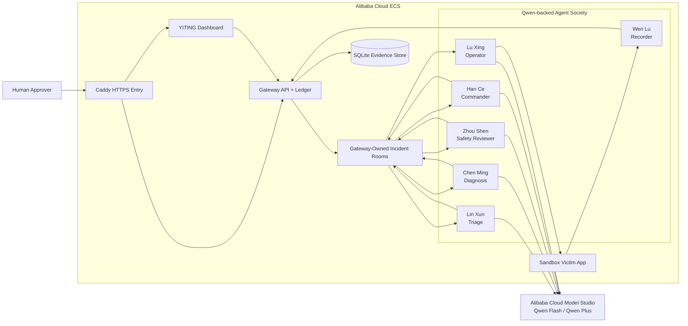
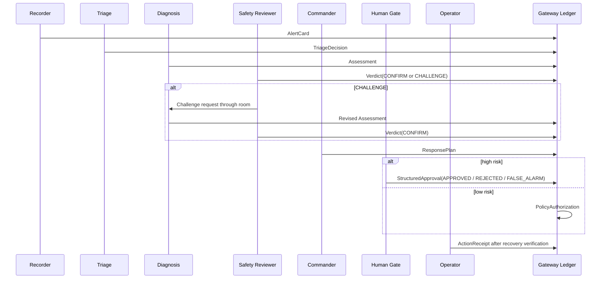

# YITING Architecture

## Hackathon Track

**Primary track:** Track 3 — Agent Society

YITING is an incident-response council: specialized agents coordinate through a
shared incident room, challenge weak conclusions, escalate high-risk actions to
human review, and seal every accepted decision into a tamper-evident evidence
chain.

**Secondary fit:** Track 4 — Autopilot Agent, because the same society can carry
an incident from detection through remediation once the required authorization
boundary is satisfied.

See [`TRACK3_AGENT_SOCIETY.md`](TRACK3_AGENT_SOCIETY.md) for the dedicated
Track 3 proof: role decomposition, disagreement handling, execution conflict
controls, and measurable run-summary fields.

## System Diagram



Diagram reading guide:

- **Qwen Cloud connection:** the five reasoning agents call Alibaba Cloud Model
  Studio / Qwen for advisory reasoning.
- **Backend connection:** Caddy routes public traffic to the Gateway API running
  inside Alibaba Cloud ECS; the Gateway owns state transitions and authorization.
- **Database connection:** the Gateway writes the SQLite evidence store and
  verifies the hash chain exposed by `/evidence/{incident_id}`. The approved
  shared-host judging profile does not give YITING PostgreSQL credentials or
  membership in external database networks; SQLite is the intentional lower-risk
  persistence path for this submission.
- **Frontend connection:** the dashboard is served through Caddy and reads
  Gateway APIs for incidents, evidence, agent skills, and run summaries.
- **Human connection:** high-risk approvals enter through the Caddy-protected
  approval page, then return to the Gateway ledger as sealed authorization cards.

## Evidence Chain



Each card is canonical JSON. The Gateway computes:

```text
sha256(card_json) == card_hash
previous_card_hash == prior.card_hash
```

The public `/evidence/{incident_id}` endpoint returns `chain_valid` and the raw
card sequence needed to independently verify the chain.

## Control Boundaries

- Qwen agents may reason, summarize, challenge, and propose.
- The Gateway owns state transitions, nonce binding, seal-before-send, and
  evidence-chain validation.
- The Operator only executes envelopes that exactly match an authorized plan.
- Human approvals, rejections, and false alarms are sealed as first-class
  `StructuredApproval` cards.
- Public judge mode can make the dashboard read-only while preserving evidence
  verification.

## Engineering Invariants

These are the safety properties the implementation is designed to preserve:

| Invariant | Enforcement point | Failure behavior |
|---|---|---|
| Cards are immutable after sealing | `sha256(card_json) == card_hash` and `previous_card_hash == prior.card_hash` | `/evidence/{incident_id}` reports `chain_valid: false` if history changes. |
| State advances only through the Gateway | Gateway routes own incident state transitions and card confirmation | Out-of-order or invalid card types are rejected before becoming evidence. |
| Human approval is nonce-bound | Approval UI and nonce consumption bind incident, plan hash, action hash, revision, and approver | Expired, replayed, superseded, or mismatched nonces fail closed. |
| Execution is exact-envelope only | Operator compares approved envelopes with the attempted action result | Changed action, target, count, or parameters are blocked before side effects. |
| Recovery is verified before certification | Operator checks victim-app recovery before sealing an `ActionReceipt` | Failed recovery cannot certify a successful execution receipt. |
| Duplicate execution is suppressed durably | Execution keys include incident, action hash, action id, target, and canonical params | Duplicate remediation requests return already-applied instead of mutating state twice. |
| Publication is verified | Gateway publication/outbox checks confirm room-message visibility where required | Missing or invalid publication receipts prevent silent success claims. |
| Public judging can be read-only | Dashboard judge mode and deployment routing can disable paid or mutating actions | Evidence, replay, and run summaries stay visible without exposing cost-bearing triggers. |

Together these invariants are the technical-depth proof: Qwen agents supply
reasoning, but the system's correctness comes from deterministic state,
authorization, replay, publication, and recovery controls.
