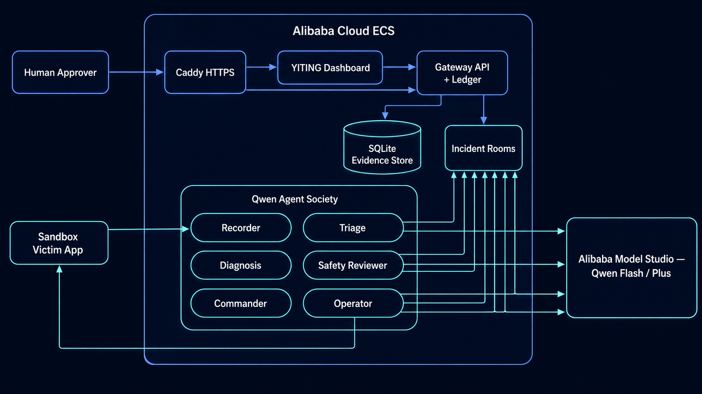

# Blog Draft: YITING, a Qwen Agent Society for Governed Incident Response

*Our journey building a Track 3 Agent Society for the Global AI Hackathon Series with Qwen Cloud: six specialized Qwen agents, one deterministic Gateway, and a benchmark that keeps the "multi-agent is better" claim honest.*



## Short Social Version

Production incidents force teams into an uncomfortable tradeoff: move fast and
risk unsafe automation, or wait for humans and lose precious recovery time.

YITING explores a third path: a Qwen-powered agent society for emergency change
control. Lin Xun triages, Chen Ming investigates, Zhou Shen challenges weak
evidence, Han Ce plans, Lu Xing executes only authorized actions, and Wen Lu
records the chain.

The key idea is not "let an agent do everything." The key idea is governed
autonomy: agents collaborate, disagree, revise, and escalate. High-risk changes
require a human decision. Low-risk changes can be policy-authorized. Every
accepted decision becomes a sealed evidence card linked by SHA-256, so reviewers
can verify the full evidence chain in a browser.

Built for the Qwen Cloud hackathon on Alibaba Cloud, YITING shows how Track 3
agent societies can be useful in real operational work: fast enough for
incidents, structured enough for audit, and constrained enough for high-stakes
systems.

## Publish-Ready Social Snippets

### LinkedIn / Blog Teaser

Most "AI incident response" demos hide the hardest question: who is allowed to
act?

YITING answers with a Qwen-backed agent society. Specialized agents triage,
diagnose, challenge, plan, and execute, but authority stays with a deterministic
Gateway and a human gate for high-risk changes. Every accepted decision becomes
a SHA-256 linked evidence card that a reviewer can verify in the browser.

The Track 3 proof is not just that an incident reached `EXECUTED`. It is that
the agents decomposed work, disagreed through sealed `Verdict(CHALLENGE)` or
`StructuredApproval(REJECTED)` cards, resolved execution conflicts through an
exact approved-action boundary, and produced paired quality gains over a
single-agent baseline. A speed claim is made only when the separate hosted
same-family timing proof supports it.
Hosted timing is measured separately from the paired benchmark.

### X / Short Post

Built YITING for Track 3: a Qwen-backed incident-response society.

Triage -> Diagnosis -> Safety Review -> Commander -> Human Gate -> Operator.

Agents can disagree and revise, but only the Gateway can authorize state
changes. Final proof: hash-chained evidence, exact-envelope execution, paired
quality gains, and separate same-family timing proof.

### Judge-Facing One Sentence

YITING is a Qwen-powered emergency-change council where specialized agents
divide incident work, challenge weak reasoning, negotiate with a human gate,
and execute only the exact approved remediation while sealing every decision
into a browser-verifiable evidence chain.

## Long Blog Version

### Why Incident Response Needs an Agent Society

Incident response is rarely a single task. It is a chain of judgments:

- Is this alert real?
- What evidence supports the diagnosis?
- Is the proposed fix safe?
- Does the change require human approval?
- Did the system actually recover?
- Can we prove what happened later?

A single autonomous agent can move quickly, but speed alone is not enough for
high-stakes operations. If a model misdiagnoses an incident or chooses an unsafe
action, the damage can be worse than the original outage.

YITING treats incident response as a society of constrained agents rather than
one all-powerful assistant.

### The Council

First, the name. **YITING** romanizes Mandarin *yi ting* — "the deliberation hall": the chamber where a council hears evidence, debates openly, and puts its judgment on the record. That is exactly what the product is — an incident council whose every claim, challenge, and decision is sealed into an auditable hash chain.

The council personas are named the same way, each for its charter: *Xun* ("swift") for the triage sentinel who reaches every alert first; *Ming* ("to illuminate") for the diagnostician who brings clarity to murky evidence; *Shen* ("prudent") for the safety reviewer who challenges weak reasoning; *Ce* ("strategy") for the commander who drafts the bounded plan; *Xing* ("to act") for the operator bound to the sealed authorization; *Wen Lu* — literally "record the record" — for the deterministic keeper of the hash chain; and *Shu* ("writing") for the postmortem scribe. These identities live in the backend (`shared/personas.py`), not just the UI, and each temperament shapes how its role behaves.

YITING uses named Qwen-backed roles:

| Agent | Responsibility |
|---|---|
| Lin Xun | Triage and alert routing |
| Chen Ming | Evidence gathering and root-cause diagnosis |
| Zhou Shen | Independent safety review and challenge |
| Han Ce | Remediation planning |
| Lu Xing | Authorized execution and recovery verification |
| Wen Lu | Deterministic recording and evidence sealing |

Each agent has a narrow authority boundary. Qwen provides advisory reasoning,
but the Gateway owns the state machine, nonce binding, authorization checks, and
evidence ledger.

The public `/agent-skills` registry makes those boundaries visible. Each role
declares its custom agent skill contract: what it may reason about, which
guardrail constrains it, which card it can publish, and which artifact proves
that work happened. That turns "multi-agent" from a loose claim into an
inspectable interface.

For the hackathon's custom-skills/MCP scoring language, `/agent-skills` is also
the machine-readable proof: a deterministic MCP-style review manifest with stable tool
names, input schemas, output schemas, Qwen prompt contracts, and evidence
artifacts for every role, plus the exact Qwen Cloud use, Track 3 proof
category, and judge demo cue. The manifest route is not a network MCP server; it is the
public custom-skill contract layer judges can inspect. And because the contracts
were MCP-shaped from the start, promoting them into a **real network MCP server**
took one thin, read-only module: `POST /mcp` (`gateway/mcp.py`) speaks JSON-RPC 2.0
(`initialize`, `tools/list`, `tools/call`) over the same seven contracts plus the
committed paired benchmark — and by design no MCP tool can mutate an incident,
approve a plan, or spend a token.

The Qwen integration itself is more sophisticated than "call a chat model."
Every advisory call goes through structured JSON mode with bounded, schema-shaped
outputs (`shared/qwen_reasoning.py`), each role runs on the cheapest Qwen tier
that its risk profile allows — Flash for bounded triage and execution validation,
Plus for diagnosis, safety challenge, and planning — with per-role fallback
models pinned in configuration (`shared/config.py`), and every prompt boundary
is a published contract in the registry, not an implementation detail.

### What Makes It Different

Most incident demos show a straight line:

```text
alert -> diagnosis -> plan -> action
```

YITING adds governance loops:

```text
Assessment -> Verdict(CHALLENGE) -> revised Assessment -> Verdict(CONFIRM)
```

and:

```text
ResponsePlan -> human rejects -> revised ResponsePlan -> human approves
```

That means the system can recover from weak evidence or a rejected plan without
losing the audit trail. The disagreement itself is preserved as evidence.

This is the Track 3 core: task decomposition, role assignment, dialogue,
negotiation, and conflict resolution. The agents do not merely pass messages;
they challenge unsupported claims, accept or reject revisions, and bind execution
to the final approved plan.

### Trust Through Evidence

Every important event becomes a sealed card:

```text
AlertCard
TriageDecision
Assessment
Verdict
ResponsePlan
StructuredApproval or PolicyAuthorization
ActionReceipt
```

Each card is canonical JSON with a SHA-256 hash. Each card points to the
previous card hash. If any historical record changes, the chain breaks.

Judges and reviewers can open:

```text
/evidence/{incident_id}
```

and verify `chain_valid: true`.

The same run exposes `/stats/runsummary`, which reports handoffs, challenges,
human interventions, recovery verification, and the optional measured speed
comparison when a same-family hosted baseline is configured.

### Human-Governed Autonomy

The system supports two authorization paths:

- Low-risk remediation can use policy authorization.
- High-risk remediation requires a human approval page.

Human decisions are first-class evidence. A human can approve, reject with
revision feedback, or mark the incident as a false alarm. The Operator executes
only the exact approved envelope. Modified or stale actions fail closed before
side effects.

This matters because the system separates recommendation from authority. Agents
can propose and revise, but the state machine decides what is valid, and the
evidence chain proves which decision won.

### Why Qwen Cloud and Alibaba Cloud Fit

Qwen is used where reasoning is valuable: triage, diagnosis, review, planning,
and execution explanation. Alibaba Cloud ECS hosts the Gateway, dashboard,
agents, and victim app. This keeps the demo close to a production deployment:
public HTTPS entrypoint, local service isolation, systemd processes, and a
repeatable deployment verifier.

The result is not just a chatbot. It is an operational control plane for agent
coordination.

### What Qwen Does And What It Does Not Do

The design is intentionally split.

Qwen helps the agents interpret evidence, compare hypotheses, write structured
plans, and explain execution outcomes. That is where language-model reasoning is
useful.

Qwen does not own authority. It cannot silently advance incident state, mint an
approval nonce, mutate historical evidence, or execute a different action from
the approved envelope. Those duties stay in deterministic Gateway code. This is
the core safety pattern: use Qwen for judgment, but keep final authority in
verifiable state transitions.

That split also makes the custom skill registry meaningful. `/agent-skills`
does not merely list prompts; it shows the exact contract around each role:
input schema, output schema, Qwen prompt boundary, deterministic guardrail, and
evidence artifact, with a judge-facing cue that explains which demo beat proves
that role's contribution.

### The Measured Result

Track 3 asks for a measurable gain over a single-agent baseline. The live half
of the answer is sealed on the hosted dashboard: 3 executed incidents with
verified recovery, 22 sealed agent handoffs, a safety challenge and a human
rejection that each forced a revised plan, and a 2.6× speedup over a measured
human baseline — a runbook-guided operator resolving the same incident family
solo in 501 seconds versus a 196-second same-family council average
(`artifacts/track3-baseline.json`, `artifacts/deployment-verification.json`).

The reproducible half is the committed deterministic society-contract regression
harness: the same 20 fixed scenarios scored identically for the society contract
and a solo baseline, deliberately isolated from model variance — contract
validation, not a live model measurement. From
`artifacts/track3-paired-benchmark.json`:

- **Task success: 100% (society contract) vs 33.33% (solo baseline).**
- **Unsupported claims: 0 vs 20** — the challenge loop deletes confident nonsense.
- **Risks surfaced: 120 vs 40** — independent review triples risk coverage.
- **Mean contract quality: 1.00 vs 0.5633.**

The benchmark deliberately does *not* claim the society is faster — it is
slower in raw latency, and we publish that. Any speed claim uses a separate
hosted same-family timing measurement, and the artifact fails closed when that
baseline is absent. Honest numbers scored better with us than inflated ones
would have — and they were easier to defend.

*(Image slot: dashboard council row and the Agents & Room topology ring showing
a live handoff.)*

### Why An Agent Society Beats A Single Agent

A single agent can be impressive in a demo, but it tends to mix diagnosis,
planning, approval, and execution in one context. YITING separates those powers.

| Single-agent risk | Agent-society control |
|---|---|
| One model can accept its own weak diagnosis. | Safety Reviewer can seal a `Verdict(CHALLENGE)` and force Diagnosis to revise. |
| One model can plan and execute without an independent authority check. | Commander can propose, but Operator executes only after policy or human authorization. |
| A rejected plan can be retried accidentally. | Human rejection burns the old nonce and forces a revised `ResponsePlan`. |
| Success claims can become screenshots without proof. | `/evidence/{incident_id}`, `/stats/runsummary`, and `artifacts/track3-paired-benchmark.json` expose chain validity, handoffs, challenges, human decisions, recovery verification, paired quality gains, and optional measured baseline speed. |

The result is not just more agents. It is a more inspectable control system:
role separation reduces blast radius, challenge loops improve evidence quality,
and the measured baseline keeps the efficiency claim honest.

### Impact

YITING targets teams that need automation but cannot afford invisible
automation:

- SRE teams responding to production incidents
- regulated engineering teams
- security operations teams
- platform teams with emergency-change procedures

The sharpest version of the pitch is regulatory. In compliance-heavy sectors —
finance, healthcare, telecom, the public sector — autonomous remediation is
effectively forbidden until every machine decision is evidenced, challengeable,
and human-gated. YITING is the architecture that makes agent autonomy
permissible where it is currently banned. That is why the paired benchmark's
**0 unsupported claims versus 20** for the single agent matters more than any
quality score: it is a trust-and-liability number, and the sealed hash chain is
the audit trail a regulator, insurer, or post-incident reviewer can replay.

The building blocks are also deliberately reusable. The skill-contract
registry, the read-only MCP server, and the hash-chain evidence gateway are not
incident-specific — they are open infrastructure any agent stack can adopt to
make its own autonomy auditable.

The product direction is clear: add more evidence connectors, organization
policy, runbook libraries, and enterprise identity integration. The core
principle stays the same:

> Agents can reason and collaborate, but authority must be explicit,
> verifiable, and reviewable.

### Potential Impact In Concrete Terms

The impact is not "AI replaces incident responders." The impact is reducing the
coordination tax around urgent production changes:

- **Faster safe recovery:** specialist agents can triage, investigate, review,
  plan, and execute in parallel handoffs instead of waiting for one person or one
  broad agent to hold the entire context.
- **Fewer unsafe automations:** exact-envelope execution means the Operator
  cannot quietly run a different remediation from the plan that was authorized.
- **Lower false-alarm cost:** bounded suppression and human false-alarm decisions
  keep noisy classes of alerts from repeatedly waking the team.
- **Audit-ready operations:** `/evidence/{incident_id}` gives reviewers the
  complete chain of reasoning, authority, execution, and recovery proof.
- **Scalable adoption:** the same control pattern can plug into more evidence
  connectors, runbook libraries, policy rules, and identity providers without
  changing the core agent-society contract.

For the final submission, those claims are tied to measurements instead of
slides: `/stats/runsummary` reports handoffs, disagreement events, human
interventions, recovery verification, and optional same-family baseline speed;
the paired benchmark reports task success, unsupported claims, risks detected,
final score, and quality per token. The proof command bundles those numbers
into `artifacts/final-proof-index.md`.

### Impact Beyond The Demo

The immediate hackathon demo is incident response, but the pattern is broader:
any high-stakes workflow that mixes AI reasoning with human authority needs the
same separation of concerns.

- **Financial operations:** agents can investigate anomalies, but payment or
  account changes require bounded approval and an evidence trail.
- **Healthcare operations:** agents can summarize signals and propose next
  steps, while policy controls protect final authority.
- **Security operations:** agents can correlate alerts, challenge weak
  evidence, and preserve the exact sequence of decisions for review.
- **Platform engineering:** agents can speed up routine recovery while keeping
  emergency changes inspectable.

The product opportunity is an open control plane for governed agent societies:
organizations bring their evidence connectors, policies, runbooks, and identity
provider; YITING supplies the collaboration model, evidence ledger, and
execution boundary.

### Reader Verification Checklist

A reader should not have to trust the blog. The public project gives concrete
checks:

1. Open `/agent-skills` to inspect the custom agent skill contracts.
2. Open `/evidence/{incident_id}` and verify `chain_valid: true`.
3. Inspect `collaboration.role_sequence` to see task decomposition.
4. Find `Verdict(CHALLENGE)` or `StructuredApproval(REJECTED)` for disagreement
   and negotiation.
5. Confirm `collaboration.execution_conflict_control.exact_match` is `true`.
6. Open `/stats/runsummary` to see handoffs, challenges, human interventions,
   recovery verification, and `speedup_factor > 1` only after the measured
   same-family baseline is configured. Use `artifacts/track3-paired-benchmark.json`
   for the reproducible quality gain.

### Closing

The next generation of useful agents will not just be autonomous. They will be
accountable. YITING is a small but concrete step toward that future: a Qwen
agent society that can move quickly during incidents while preserving the
evidence humans need to trust it.

### How We Prove It

For the final submission, the project includes a judge-facing proof bundle:

```text
make submission-proof
artifacts/qwen-smoke.json
scripts/track3_baseline.py
artifacts/track3-baseline.json
artifacts/deployment-verification.json
dist/yiting-submission-source.zip
```

The baseline helper records a measured single-agent/manual comparison for the
same incident type. The deployment verifier then fails closed unless the hosted
run proves `speedup_factor > 1`. The paired benchmark separately records
quality, reliability, and quality-per-token gains without claiming speed. That
keeps the story honest: YITING is not just a polished dashboard; it is an agent
society with auditable collaboration and measured efficiency evidence.
